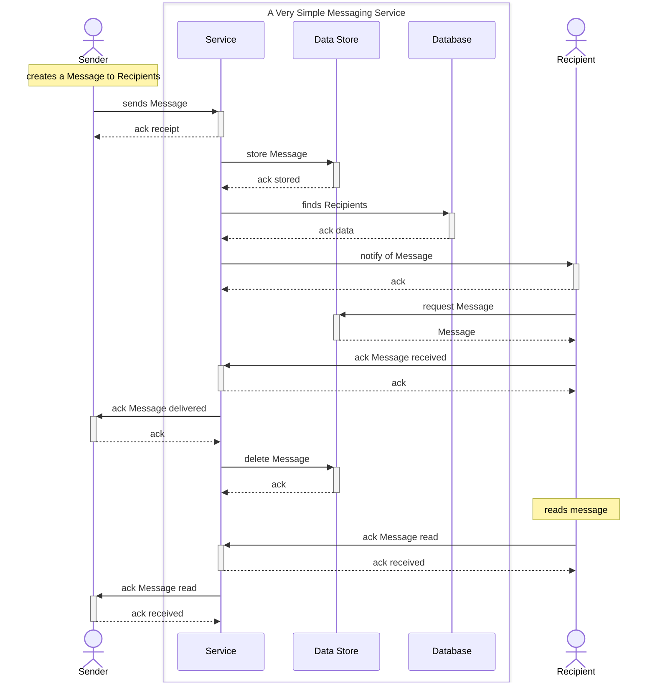

# Asynchronous events

We are building a simple messaging application, that can be used to send text and media to one or more contacts.

Messages are relayed through a server.
- Sender creates a text or media Message, destined for one or more Recipients
- Service
  - receives Message
  - sends an acknowledgement of receipt to Sender
  - places Message text or media in data store
  - looks up Recipients unique identifier
  - looks up current IP address for Recipients
  - sends Message notification to Recipient devices
- Recipient
  - downloads Message from data store
  - sends acknowledgement of receipt to Service
- Service
  - sends acknowledgement of delivery to Sender
  - deletes Message from data store
- Recipient
  - reads Message
  - sends acknowledgement of read to Service
- Service
  - sends acknowledgement of read to Sender

As can be seen from the above, many steps are involved in the transmission of a message!

